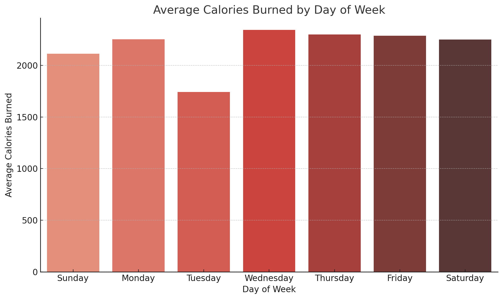

# Bellabeat Wellness Case Study

**Google Data Analytics Professional Certification (Coursera)**  

## 📌 Overview  
This case study analyzes wellness behaviors of FitBit users to identify actionable insights for Bellabeat, a wellness technology company.  

## 📁 Project Files
- [Analysis Document (PDF)](Dragos_Andrei_SPATAREANU_wellness_tech_company_all_steps.pdf)
- [Weekly Activity Summary (CSV)](Weekly_Activity_Summary.csv)
- [Presentation (PPT)](Dragos_Andrei_SPATAREANU_Bellabeat_Case_Study_Presentation.pptx)
- [Coursera Scenario PDF](Case%20Study%202_%20How-can-a-wellness-technology-company-play-it-smart.pdf)

## 📊 Key Visualizations
| Visualization                      | Preview                                                 |
|------------------------------------|---------------------------------------------------------|
| Avg. Steps                         |           |
| Avg. Calories Burned               |  |
| Avg. Sedentary Minutes             |  |
| Avg. Active Minutes                |  |
| Steps vs Calories Correlation      |  |
| Steps vs Sedentary Correlation     |  |

## 🛠️ Tools and Skills
- **R (tidyverse, lubridate)**
- **Data Cleaning & Analysis**
- **Data Visualization**
- **PowerPoint Presentation**

## 🧑‍💻 Author  
- Dragos-Andrei SPATAREANU  
- [LinkedIn](https://www.linkedin.com/in/dragos-andrei-spatareanu-59b56325a)  
- [GitHub](https://github.com/sdragos14)

